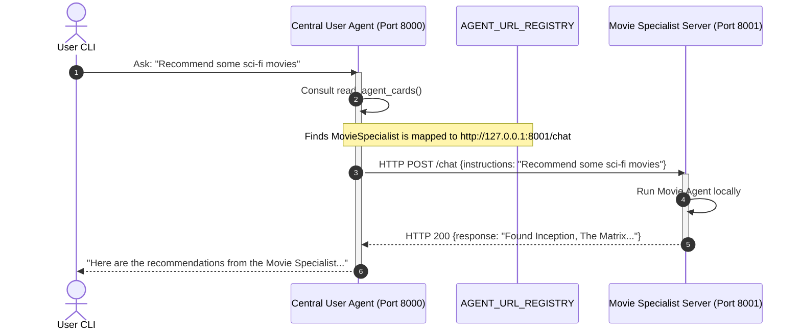

# Agent-to-Agent (A2A) Distributed Architecture Documentation

This document explains the concepts, design, and execution of the **Agent-to-Agent (A2A)** framework, focusing on how agents are decoupled into separate servers and configured to communicate over HTTP.

---

## 1. What is Agent-to-Agent (A2A)?

In complex LLM applications, a single agent with too many tools can suffer from:
1. **Context Window Overload**: Too many system instructions and tool schemas decrease response quality.
2. **Task Confusion**: The LLM struggles to select the correct tool from a massive catalog.
3. **Tight Coupling**: Codebases become monolithic and difficult for multiple teams to scale.

**A2A** resolves these issues by dividing responsibilities:
- **Central Supervisor (User Agent)**: Understands the user's intent, queries a directory of available specialized agents, and dispatches sub-tasks to the best-suited agent.
- **Specialized Workers (e.g., Movie Specialist)**: Focus entirely on a single domain (like cinematic analysis, databases, or math) and run their own isolated tools.

---

## 2. Distributed Architecture (Multi-Server)

In a production environment, agents run on different servers, possibly managed by separate teams, written in different languages, and scaled independently.



---

## 3. Configuration & Communication Schema

### Registry Setup
Instead of importing the agent instances directly, the supervisor is configured with the endpoints of the remote agents using `AGENT_URL_REGISTRY`:

```python
AGENT_URL_REGISTRY = {
    "MovieSpecialist": os.getenv("AGENT_MOVIE_SPECIALIST_URL", "http://127.0.0.1:8001/chat")
}
```

### API Contracts (Payloads)

Workers expose a REST API. The communication payload follows a strict JSON schema:

#### Request Body (`POST /chat`)
```json
{
  "instructions": "Recommend movies in the Sci-Fi genre."
}
```

#### Response Body (`HTTP 200`)
```json
{
  "agent_name": "MovieSpecialist",
  "response": "Found top sci-fi movies: Inception, The Matrix, Interstellar.",
  "status": "success"
}
```

---

## 4. Source Code Component Breakdown

The modified [a2a.py](file:///d:/AI-ML/A2A/a2a.py) contains three runtime modules:

1. **The Shared Logic**: Defines LLM connection details, specialized tools (`fetch_movies`), and compiles both the worker and supervisor agents using LangGraph's `create_agent`.
2. **The FastAPI Application**: Wraps the Movie Specialist worker agent. Exposes `/chat` to receive remote execution prompts.
3. **The CLI Supervisor Interface**: Runs a loop accepting user input. If it needs a worker, it uses `dispatch_to_agent`, which translates the call to an HTTP POST request to the endpoint listed in `AGENT_URL_REGISTRY`.

---

## 5. How to Run and Configure

### Prerequisites
Make sure your environment variables are configured in the [d:\AI-ML\A2A\.env](file:///d:/AI-ML/A2A/.env) file. 

The application utilizes packages installed in your virtual environment:
- **FastAPI** & **Uvicorn** (for hosting the API endpoints)
- **Requests** (for executing HTTP calls)

---

### Option A: Running the Integrated Demo (Single Command)
To quickly test the network communication without opening multiple terminal windows, run the script in **demo mode**:
```bash
d:\AI-ML\.venv\Scripts\python.exe d:\AI-ML\A2A\a2a.py --mode demo
```
*This command starts the FastAPI worker server in a background thread and simultaneously boots the Supervisor CLI in the main thread.*

---

### Option B: Running Standalone Servers (Production Style)

To run the components as completely independent processes:

1. **Start the Movie Worker Server** on Port 8001:
   ```bash
   d:\AI-ML\.venv\Scripts\python.exe d:\AI-ML\A2A\a2a.py --mode worker
   ```
   *Expected console output:*
   ```text
   Starting Movie Specialist Worker Service on 127.0.0.1:8001...
   INFO:     Started server process [12480]
   INFO:     Waiting for application startup.
   INFO:     Application startup complete.
   INFO:     Uvicorn running on http://127.0.0.1:8001 (Press CTRL+C to quit)
   ```

2. **Start the Central User Agent (Supervisor)** in a separate terminal:
   ```bash
   d:\AI-ML\.venv\Scripts\python.exe d:\AI-ML\A2A\a2a.py --mode supervisor
   ```
   *Expected console output:*
   ```text
   Initializing A2A central User Agent (Supervisor)...
   Registry configured with: {'MovieSpecialist': 'http://127.0.0.1:8001/chat'}
   
   User: 
   ```

---

## 6. Sample Interactive Session Walkthrough

When you type a query like `Recommend some sci-fi movies`, the following flow occurs:

1. **User input is received by the Central User Agent (Supervisor)**.
2. **User Agent discovers workers** by running `read_agent_cards`:
   ```text
   [A2A] User Agent reading registry...
   ```
3. **User Agent selects `MovieSpecialist`** and calls `dispatch_to_agent`:
   ```text
   [A2A HTTP Dispatcher] Dispatching to remote agent -> MovieSpecialist at http://127.0.0.1:8001/chat
   [A2A HTTP Dispatcher] Payload: Recommend some movies in the sci-fi genre and tell me why they are good.
   ```
4. **The Worker FastAPI server receives the call** and runs its internal agent:
   ```text
   [Worker Service] Received remote call: 'Recommend some movies in the sci-fi genre and tell me why they are good.'
   [Tool] Movie Agent fetching: sci-fi
   [Worker Service] Agent responded successfully.
   ```
5. **The Supervisor Agent receives the response** and prints it out:
   ```text
   Final Output:
   According to the MovieSpecialist, they found the following top sci-fi movies: Inception, The Matrix, and Interstellar. They recommend them because they are cinematic masterpieces...
   ```
